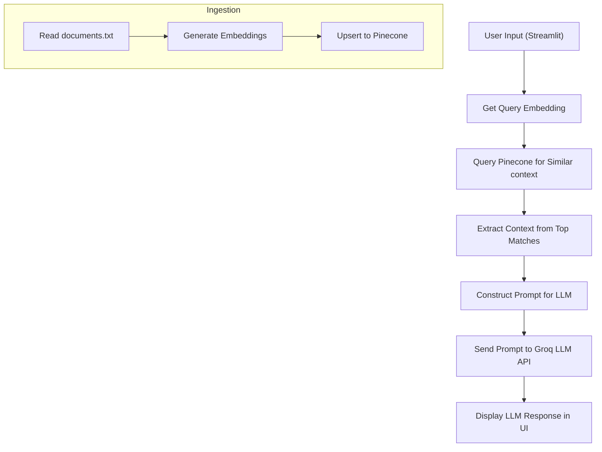

# RAG Chatbot Project


## Project Structure

```
rag-chatbot/
│
├── app.py                # Main Streamlit app for chat interface
├── ingest.py             # Script to ingest documents into Pinecone
├── requirements.txt      # Python dependencies
│
├── utils/
│   ├── embedder.py       # Embedding generation utility
│   ├── llm_utils.py      # LLM (Groq) query utility
│   └── pinecone_utils.py # Pinecone vector DB utility
│
├── .streamlit/
│   ├── secrets.toml      # Streamlit secrets for API keys
│   └── config.toml       # (Optional) Streamlit configuration
│
└── .vercel/
    └── project.json      # (Optional) Vercel deployment config

### 1. Data Ingestion

- **Script:** `ingest.py`
- **Purpose:** Generates embeddings from your data and upserts them into a Pinecone vector database.
- **How it works:**
  1. Loads API keys from Streamlit secrets (`.streamlit/secrets.toml`).
  2. Initializes Pinecone client.
  3. Reads your data as context.
  4. Generates an embedding for each context using Sentence Transformers.
  5. Upserts the embeddings and metadata into Pinecone.
- Script: `ingest.py`
- Purpose: Reads context, generates embeddings, and upserts them into a Pinecone vector database.
- How it works:
  1. Loads API keys from Streamlit secrets (`.streamlit/secrets.toml`).
  2. Initializes Pinecone client.
  3. Reads each word from context.
  4. Generates an embedding for each context using Sentence Transformers.
  5. Upserts the embeddings and metadata into Pinecone.

### 2. Chatbot Application

- Script: `app.py`
- Purpose: Provides a Streamlit web interface for users to ask questions and get answers using RAG.
- How it works:
  1. Loads API keys from Streamlit secrets (`.streamlit/secrets.toml`).
  2. Initializes Pinecone client.
  3. Accepts user query via Streamlit input.
  4. Generates embedding for the query.
  5. Queries Pinecone for top relevant documents.
  6. Constructs a prompt with retrieved context and user question.
  7. Sends the prompt to Groq LLM via API.
  8. Displays the LLM’s answer in the UI.

---


## Utility Modules

- `utils/embedder.py`  
  Loads a Sentence Transformer model (`all-MiniLM-L6-v2`) and provides a `get_embedding(text)` function.

- `utils/pinecone_utils.py`  
  Handles Pinecone index creation, upsert, and query operations via the `PineconeClient` class.

- `utils/llm_utils.py` 
  Provides `query_llm(prompt, provider)` to send prompts to Groq’s LLM API and handle responses/errors. Now uses Streamlit secrets for API key management.

---


## API Keys & Streamlit Secrets

All API keys are now managed using Streamlit's secrets system. You must add your keys to `.streamlit/secrets.toml`:

```toml
[general]
PINECONE_API_KEY = "your-pinecone-api-key"
GROQ_API_KEY = "your-groq-api-key"
```

**Note:**
- Do not commit `.streamlit/secrets.toml` to version control.
- The app no longer uses a `.env` file for secrets.

---


## Usage

### 1. Install Dependencies

```bash
pip install -r rag-chatbot/requirements.txt
```

### 2. Configure Streamlit Secrets

Create a file at `rag-chatbot/.streamlit/secrets.toml` and add your API keys as shown above.

### 3. (Optional) Configure Streamlit Settings

You can customize Streamlit behavior by editing `rag-chatbot/.streamlit/config.toml`.

### 4. Ingest Data

```bash
python rag-chatbot/ingest.py
```
 This will process your data and upload embeddings to Pinecone.

### 5. Run the Chatbot

```bash
streamlit run rag-chatbot/app.py
```
- Open the provided local URL in your browser to interact with the chatbot.

---

## Deployment

- The project includes a `.vercel/project.json` file, suggesting optional Vercel deployment.
- For local use, Streamlit is sufficient.

---

## Pipeline Diagram



---


## Notes

- The LLM provider is Groq, using the `llama-3.1-8b-instant` model.
- Pinecone is used for vector storage and retrieval.
- Embeddings are generated using `sentence-transformers` (`all-MiniLM-L6-v2`).
- The project is modular and can be extended with new data or different LLM/vector DB providers.
- All secrets are now managed via `.streamlit/secrets.toml`.
- You can further configure Streamlit using `.streamlit/config.toml`.
